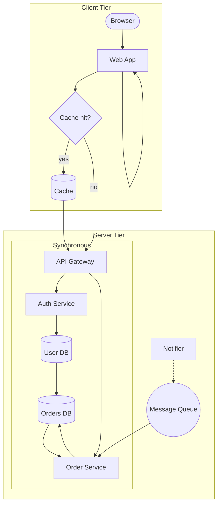

# Muffin Markdown Example

中文 | English

This document is a Markdown syntax sample for exercising Muffin's parser, renderer, and editing paths.

## Inline Features

Plain text can mix **bold**, *italic*, ~~strikethrough~~, `inline code`, inline HTML <kbd>Ctrl</kbd> + <kbd>S</kbd>, links such as [Muffin](https://example.com), autolinks like https://example.com, and inline math $E = mc^2$.

Escaped punctuation stays literal: \*not emphasized\*, \`not code\`, \[not a link\].

Entities are decoded by renderers: &amp; &lt; &gt; &copy;.

## Headings

# Heading 1 sample
## Heading 2 sample
### Heading 3 sample
#### Heading 4 sample
##### Heading 5 sample
###### Heading 6 sample

## Paragraphs and Line Breaks

Markdown paragraphs are separated by blank lines. Soft line breaks normally stay inside the same paragraph.
This line follows a soft break.

Two trailing spaces create a hard line break.  
This line starts after a hard break.

## Block Quotes

> A block quote can contain paragraphs.
>
> It can also contain **formatting**, `code`, and nested quotes.
>
> > Nested quote.

## Lists

Unordered list:

- First item
- Second item with **bold** text
- Third item
  - Nested item
  - Another nested item

Ordered list:

1. First step
2. Second step
3. Third step
   1. Nested ordered step
   2. Another nested ordered step

Task list:

- [x] Parse CommonMark blocks
- [x] Parse GFM tables and task markers
- [x] Parse inline and block math
- [x] Render Markdown from the document AST
- [x] Edit tables, code fences, math blocks, and HTML blocks
- [ ] Complete export workflows

## Links and Images

Inline link: [GitHub cmark-gfm](https://github.com/github/cmark-gfm)

Reference link: [Qt][qt-link]

Autolink: https://www.qt.io

Email autolink: <hello@example.com>

### Images

Image with title:


Image without title:


WebP images (require Qt WebP plugin):


Embedded base64 image (data URI, RFC 2397) — fully self-contained, needs no network or local file:

![Muffin icon](data:image/png;base64,iVBORw0KGgoAAAANSUhEUgAAACAAAAAgCAYAAABzenr0AAAACXBIWXMAAA7EAAAOxAGVKw4bAAADp0lEQVRYheVXPUhrSRT+ziSEkB9Zkijsvi3WImm0MHb2QRu1cbVIJ4JtUDapNJVWIqRKISkNyv68bQTtBDGwbGWRJikUBd0iEXY3uSHey52zxTND4s29Sdz3qvfBhfk538w3Z87MPQN87aB+jcxMAL4F4LHj6bruk1JGmDnCzGEhRJiZI1LKCBFFAIQBhJnZR0SPUsqDQCDwKxGxrRpmFsyckVL+w58ZUko2DOMjMwu7yckwjN8/98R9kO67BY1GY9Xv9/9MRDBNE5qmKSOPxwOv12vruX5ot9vQdV3V/X4/XC4XmPlfIvrGshWapv3ZkVipVDgajapvYWGBdV0feokvLy88Pz/fM0alUuk2+a4zr9oPZv5gt5rb21sUCoWhV18oFHB3d+dkooJbCSCiVre7EokE4vG4YuTzeTw8PAyc/P7+Hvl8XtXj8TgSiQT8fr8zUdO0P966slQq9bhxY2ODpZS2rpdS8vr6eg+nVCr1M/3B4gEAz4NWd3V1hYuLC9v+8/NzXF9fDxqmB90xUB+GsLe3h2azaWlvNBrY398fafIeAUKIoQTUajXkcjlLey6XQ61We78AInIUQEQYHx8HABwfH6NcLqu+crmMYrEIAJiYmABR3xveWYCU0jEGhBDIZDIdW2SzWZimCdM0kc1mIaUEAGQyGQjR/7btgs8igIgGBuHy8rI6muVyGaenpzg5OVHemJ2dxdLS0qBh0G63I52yu0vAwBggIuzu7mJlZQXMjMPDQ0vfMO5nZiVg5CCcnp7G6uoqAKDZbKoTsba2hqmpqWGGABGFLQI8Hk+rv7kV29vbCAaDqj42Noatra1h6WBmqwAA9onCG4RCIaRSKVVPpVIIhUJDCwBg3YJRkUwmEY1GEY1GkUwmR+J2x4DbydAJbrcbOzs7ICK4XK5R6f9fAADMzc29l6pioK+AWq2Go6MjPD09qTbTNNVdn06n4fH05qu6ruPg4EDZdlAsFnF5eYnNzU11k3afAnVoX3+RdwBQrVaxuLhoK//m5gY+n6+nrdVqYWZmxpZzdnaGWCwGANA07TEQCHwP9Aah3o/4JUBEj6rcKfCnt8DfAMba7bZjShWLxSyBZ5omqtWqLWdychJerxfMDE3T1oLB4C8WI2bODJ15vhOGYfz2ulgrmFkYhvHRKe16L14fO2l+8zCxKGFmajabPwohfmLmD0KIFjM/41PKVn/9adWJ6JmZn4mo7vV66wCcrnIdwF+Oz7KvFv8BqMB7r1rLBZEAAAAASUVORK5CYII=)

A base64 image composes inline like any other image: the ![Muffin](data:image/png;base64,iVBORw0KGgoAAAANSUhEUgAAACAAAAAgCAYAAABzenr0AAAACXBIWXMAAA7EAAAOxAGVKw4bAAADp0lEQVRYheVXPUhrSRT+ziSEkB9Zkijsvi3WImm0MHb2QRu1cbVIJ4JtUDapNJVWIqRKISkNyv68bQTtBDGwbGWRJikUBd0iEXY3uSHey52zxTND4s29Sdz3qvfBhfk538w3Z87MPQN87aB+jcxMAL4F4LHj6bruk1JGmDnCzGEhRJiZI1LKCBFFAIQBhJnZR0SPUsqDQCDwKxGxrRpmFsyckVL+w58ZUko2DOMjMwu7yckwjN8/98R9kO67BY1GY9Xv9/9MRDBNE5qmKSOPxwOv12vruX5ot9vQdV3V/X4/XC4XmPlfIvrGshWapv3ZkVipVDgajapvYWGBdV0feokvLy88Pz/fM0alUuk2+a4zr9oPZv5gt5rb21sUCoWhV18oFHB3d+dkooJbCSCiVre7EokE4vG4YuTzeTw8PAyc/P7+Hvl8XtXj8TgSiQT8fr8zUdO0P966slQq9bhxY2ODpZS2rpdS8vr6eg+nVCr1M/3B4gEAz4NWd3V1hYuLC9v+8/NzXF9fDxqmB90xUB+GsLe3h2azaWlvNBrY398fafIeAUKIoQTUajXkcjlLey6XQ61We78AInIUQEQYHx8HABwfH6NcLqu+crmMYrEIAJiYmABR3xveWYCU0jEGhBDIZDIdW2SzWZimCdM0kc1mIaUEAGQyGQjR/7btgs8igIgGBuHy8rI6muVyGaenpzg5OVHemJ2dxdLS0qBh0G63I52yu0vAwBggIuzu7mJlZQXMjMPDQ0vfMO5nZiVg5CCcnp7G6uoqAKDZbKoTsba2hqmpqWGGABGFLQI8Hk+rv7kV29vbCAaDqj42Noatra1h6WBmqwAA9onCG4RCIaRSKVVPpVIIhUJDCwBg3YJRkUwmEY1GEY1GkUwmR+J2x4DbydAJbrcbOzs7ICK4XK5R6f9fAADMzc29l6pioK+AWq2Go6MjPD09qTbTNNVdn06n4fH05qu6ruPg4EDZdlAsFnF5eYnNzU11k3afAnVoX3+RdwBQrVaxuLhoK//m5gY+n6+nrdVqYWZmxpZzdnaGWCwGANA07TEQCHwP9Aah3o/4JUBEj6rcKfCnt8DfAMba7bZjShWLxSyBZ5omqtWqLWdychJerxfMDE3T1oLB4C8WI2bODJ15vhOGYfz2ulgrmFkYhvHRKe16L14fO2l+8zCxKGFmajabPwohfmLmD0KIFjM/41PKVn/9adWJ6JmZn4mo7vV66wCcrnIdwF+Oz7KvFv8BqMB7r1rLBZEAAAAASUVORK5CYII=) icon renders embedded in this sentence.

Image in a paragraph with surrounding text. The image  appears inline.

Multiple images in sequence:   

[qt-link]: https://www.qt.io

## Code

Inline code: `cmark_node_get_type(node)`.

Indented code:

    conan install . -s build_type=Release -s compiler.cppstd=17
    cmake --build --preset conan-release

Fenced code:

```cpp
#include <QApplication>

int main(int argc, char** argv) {
  QApplication app(argc, argv);
  return app.exec();
}
```

```powershell
cmake --build --preset conan-release --target dist
.\build\dist\Muffin.exe example.md
```

## Table

| Feature | Status | Notes |
| :--- | :---: | ---: |
| Paragraphs | Implemented | CommonMark |
| Tables | Editable | GFM table model operations |
| Code fences | Editable | Language and literal updates |
| HTML blocks | Editable | Sanitized preview support |
| Math | In progress | Parser, block edits, native renderer work |
| Exports | Planned | HTML/PDF/Pandoc workflows |

## Thematic Breaks

---

***

___

## Math

Inline math uses single dollar delimiters: $E = mc^2$ and $a_1 + b_1 = c_1$.

Block math uses double dollar fences:

$$
\int_0^1 x^2\,dx = \frac{1}{3}
$$

Another block:

$$
\begin{aligned}
a^2 + b^2 &= c^2 \\
e^{i\pi} + 1 &= 0
\end{aligned}
$$

## HTML

### Details and Summary

<details>
<summary>HTML block sample</summary>

Muffin preserves raw HTML as Markdown source and routes preview-oriented behavior through an HTML sanitizer.

</details>

### Inline Formatting

This paragraph exercises <b>bold</b>, <strong>strong</strong>, <i>italic</i>, <em>emphasis</em>, <u>underline</u>, <s>strikethrough</s>, <del>deleted</del>, <ins>inserted</ins>, <mark>highlighted</mark>, <code>inline code</code>, <kbd>Ctrl</kbd>+<kbd>C</kbd>, and <small>small text</small> inline elements.

Superscript and subscript: H<sub>2</sub>O is water. E = mc<sup>2</sup> is Einstein's equation. The 1<sup>st</sup> and 2<sup>nd</sup> items.

The <abbr title="HyperText Markup Language">HTML</abbr> abbreviation element shows a tooltip on hover.

### Inline Styles

<span style="color: red;">Red text</span>, <span style="color: #0000ff;">blue hex color</span>, and <span style="color: rgb(0, 128, 0);">green RGB color</span>.

<span style="font-size: 24px;">Large text</span> and <span style="font-size: 10px;">small text</span> using font-size.

<span style="font-weight: bold;">Bold via style</span>, <span style="font-style: italic;">Italic via style</span>, <span style="text-decoration: underline;">Underline via style</span>, and <span style="text-decoration: line-through;">Line-through via style</span>.

### Text Alignment

<div style="text-align: left;">Left-aligned text (default).</div>

<div style="text-align: center;">Center-aligned text.</div>

<div style="text-align: right;">Right-aligned text.</div>

<div style="text-align: justify;">Justified text stretches across the full width so that both the left and right edges are flush. This is most noticeable in wider paragraphs.</div>

### Backgrounds and Borders

<div style="background-color: #e8f4fd; padding: 12px; border: 1px solid #2196f3;">A blue info box using background-color, padding, and border.</div>

<div style="background-color: #fff3e0; padding: 12px; border: 2px solid #ff9800;">An orange warning box with thicker border.</div>

<div style="background-color: #e8f5e9; padding: 12px; border: 1px solid #4caf50; margin: 8px;">A green success box with margin.</div>

### Margins and Padding

<div style="border: 1px solid #ccc;">No extra margin or padding.</div>

<div style="border: 1px solid #ccc; margin: 16px;">16px margin on all sides.</div>

<div style="border: 1px solid #ccc; padding: 16px;">16px padding on all sides.</div>

<div style="border: 1px solid #ccc; margin: 8px; padding: 12px;">Both margin and padding combined.</div>

### HTML Tables

<table>
  <caption>Language Comparison</caption>
  <thead>
    <tr>
      <th>Language</th>
      <th>Typing</th>
      <th>Paradigm</th>
    </tr>
  </thead>
  <tbody>
    <tr>
      <td>C++</td>
      <td>Static</td>
      <td>Multi-paradigm</td>
    </tr>
    <tr>
      <td>Python</td>
      <td>Dynamic</td>
      <td>Multi-paradigm</td>
    </tr>
    <tr>
      <td>Haskell</td>
      <td>Static</td>
      <td>Functional</td>
    </tr>
  </tbody>
</table>

### HTML Lists

<ul>
  <li>Unordered item one</li>
  <li>Unordered item two</li>
  <li>Unordered item three</li>
</ul>

<ol>
  <li>Ordered step one</li>
  <li>Ordered step two</li>
  <li>Ordered step three</li>
</ol>

### Blockquote

<blockquote>
  This is an HTML blockquote. It can contain <strong>formatting</strong>, <em>emphasis</em>, and <code>inline code</code>.
</blockquote>

### Preformatted Text

<pre>
void hello() {
    printf("Hello, HTML pre!\n");
}
</pre>

### Headings in HTML

<h1>HTML Heading 1</h1>
<h2>HTML Heading 2</h2>
<h3>HTML Heading 3</h3>
<h4>HTML Heading 4</h4>
<h5>HTML Heading 5</h5>
<h6>HTML Heading 6</h6>

### Semantic Elements

<header>
  <p>This is a header element.</p>
</header>

<main>
  <section>
    <p>A section inside main content.</p>
  </section>
  <article>
    <p>An article element for self-contained content.</p>
  </article>
</main>

<aside>
  <p>An aside element for tangential content.</p>
</aside>

<nav>
  <p>Navigation links could go here.</p>
</nav>

<footer>
  <p>This is a footer element.</p>
</footer>

### Figure and FigCaption

<figure>
  
  <figcaption>The GitHub favicon used as a figure example.</figcaption>
</figure>

### Horizontal Rule

<p>Text before the rule.</p>
<hr>
<p>Text after the rule.</p>

### Line Breaks

First line.<br>Second line after a forced break.<br>Third line.

### Links and Images in HTML

<a href="https://www.qt.io">Qt Framework</a> rendered as an HTML anchor.


### Styled Card Example

<div style="background-color: #f5f5f5; border: 1px solid #ddd; padding: 16px; margin: 8px;">
  <h3 style="margin: 0 0 8px 0;">Card Title</h3>
  <p style="margin: 0 0 8px 0;">This is a card-like component built entirely with inline styles, using background-color, border, padding, and margin.</p>
  <small style="color: #888;">Card footer note</small>
</div>

### Nested HTML

<div style="background-color: #fafafa; padding: 12px; border: 1px solid #eee;">
  <h4>Nested Container</h4>
  <p>This outer div contains <strong>rich content</strong> including:</p>
  <ul>
    <li>A <span style="color: blue;">blue span</span> inside a list item</li>
    <li>A <mark>highlighted mark</mark> element</li>
    <li>Code: <code>nested_inline_code</code></li>
  </ul>
  <blockquote style="border: 1px solid #ccc; padding: 8px;">
    A nested blockquote with its own border and padding.
  </blockquote>
</div>

## HTML Sanitizer Fixture

The raw HTML below is intentionally unsafe. Muffin should preserve it as source text, but a sanitized preview must remove scripts, event handlers, and `javascript:` URLs.

<div onclick="alert('unsafe')">
  <a href="javascript:alert('xss')">unsafe link</a>
  <script>alert('blocked');</script>
</div>

## Mermaid

A complex flowchart exercising nested subgraphs, cluster-crossing edges, several node shapes, edge labels, a self-loop, and a cycle.

> The native Mermaid renderer renders this fence as a live diagram (parse → Dagre layout → Qt paint, no JS/browser runtime). The cached render is async; editing the fence shows the source. PDF/print and HTML export include the diagram too.



## Unsupported or Planned Markdown-Adjacent Features

The following syntax is useful for compatibility tests, but full editing/rendering support is not complete yet:

- Footnotes: `A note reference[^sample-note]`
- Definition lists
- Mermaid diagrams: flowchart is rendered natively; other diagram types (sequence, state, …) fall back to source
- Front matter editor
- Embedded rich media

[^sample-note]: Footnote syntax is included as a compatibility sample.
